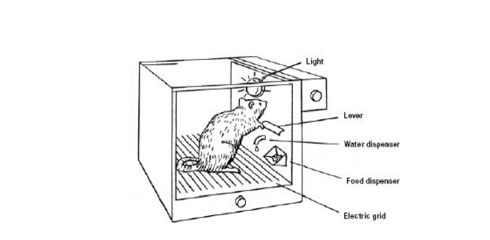
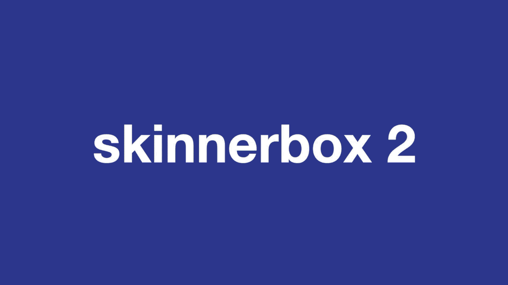
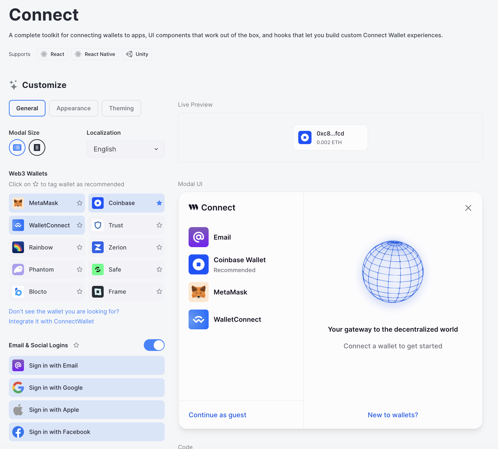
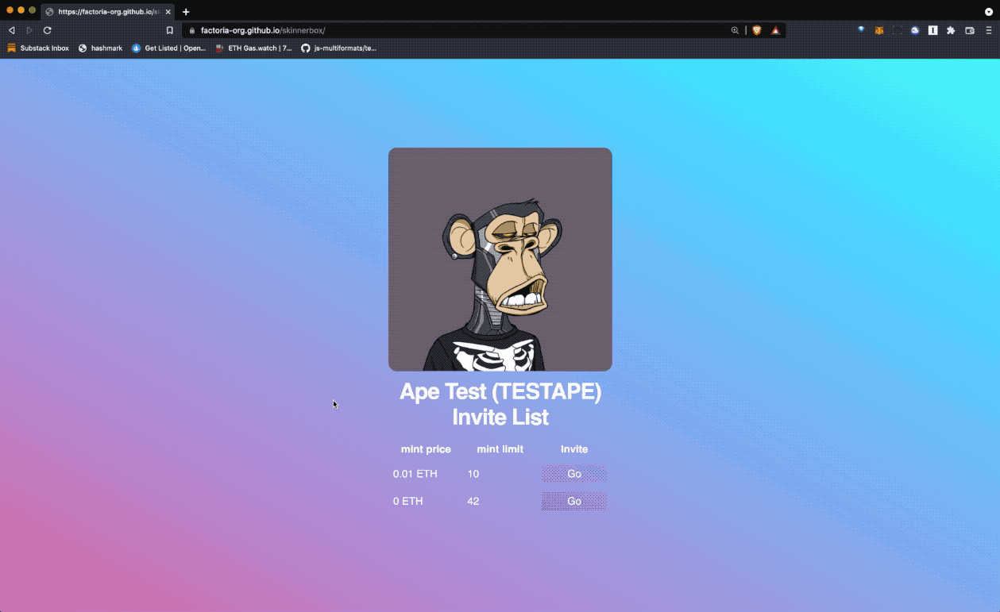

#Repo Under Construction

# Skinnerbox v3

> A dead simple forkable NFT vending machine



# How is this different from Skinnerbox v1 & v2?

> The original Skinnerbox is at https://github.com/factoria-org/skinnerbox



1. Walletconnect support: v1 only supported Metamask. Skinnerbox2 uses [Walletconnect](https://walletconnect.com/), which means it supports all wallets, including mobile.
2. Better error handling: v1 didn't do much to handle errors. Skinnerbox2 now prints out all errors when something goes wrong, so it's easier to understand what's gone wrong.
3. Requires infura ID: Because walletconnect requires you to insert an Infura ID, you need to set up an Infura account (FREE) and use its project ID.

> Version 2 Skinnerbox is at https://github.com/factoria-org/skinnerbox2
1. v2 uses Walletconnect v1, which has been sunsetted. Skinnerbox3 now uses thirdwebs connect wallet button (which includes Walletconnect v2 configuration options), which is the latest version. This means that Skinnerbox3 now supports all wallets, including mobile (again). Additiaonlly, it supports email login (with paper), local wallet, and many more options. [Connect](https://thirdweb.com/dashboard/wallets/connect) button by thirdweb is the most advanced wallet connect button available.



2. Skinnerbox3 now uses [tailwind](https://tailwindcss.com/docs/installation) for styling, which makes it easier to customize the look and feel of the vending machine.
3. Advanced Features: gasless transactions, custom chains, and more. 

# Usage

Here's an example walkthrough of how it's used:



You can try it out here: https://factoria-org.github.io/skinnerbox2


# How to use

1. Go deploy an NFT contract with [Factoria](https://factoria.app/)
2. Fork this repository
3. Go to the [`parameters.ts`](/src/consts/parameters.ts) and update the following values:

* `contractConst`: The smart contract address of your NFT drop.
* `chainConst`: The name of the chain that your smart contract is deployed to.

> Note: If you are using one of thirdweb's [default supported chains](https://portal.thirdweb.com/react/react.thirdwebprovider#default-chains) You can use the chain name as string.

#### Example

```ts
export const chainConst = "ethereum";
```

If you are using any other chain, you need to provide the chain object from the `@thirdweb-dev/chains` package to `ThirdwebProvider`'s `activeChain` prop as mentioned [here](https://portal.thirdweb.com/react/react.thirdwebprovider#activechain-recommended).


#### Example

```ts
import { Sepolia } from '@thirdweb-dev/chains';

export const chainConst = Sepolia;
```

If your chain is not included in the `@thirdweb-dev/chains` package, you can provide the chain information yourself by creating an object as mentioned [here](https://portal.thirdweb.com/react/react.thirdwebprovider#custom-evm-chains)

4. Create a `.env` file in the root directory and add your thirdweb client ID as `VITE_TEMPLATE_CLIENT_ID`
5. Create github pages ([tutorial](https://dev.to/byteslash/getting-started-with-github-pages-4jpf))

### 3. Customize the Styling

You can change the theme and primary color of the page by updating `primaryColorConst` and `themeConst` in [`parameters.ts`](/src/consts/parameters.ts).

If you want to go further, you can also update the styles in the respective components by changing the [Tailwind](https://tailwindcss.com/) classes.

### 4. Optional: Add Gasless Transaction Support

If you want to sponsor the gas fees for your user, you can update the `relayerUrlConst` in [`parameters.ts`](/src/consts/parameters.ts) to point to your Open Zeppelin relayer or `biconomyApiKeyConst` and `biconomyApiIdConst` to use Biconomy.

Learn more: https://portal.thirdweb.com/glossary/gasless-transactions

## Deploying Your Site

### Deploying to IPFS

To deploy your site to IPFS, run the following command:

```bash
yarn deploy
```

This will deploy your site and output the IPFS hash of your site. You can then grab the IPFS hash and replace it with the one you get on the Embed tab on your contract on dashboard, so you get the updated version on your website once you copy it over.

### Deploying to a centralized server

You can also deploy it to any centralized server like any normal website.

## Join the thirdweb Discord for thirdweb support!

For thirdweb support, join the discord at [https://discord.gg/thirdweb](https://discord.gg/thirdweb).

## Join the Factoria Discord for Factoria support!
For any Factoria questions or suggestions, join the discord at [https://discord.gg/BZtp5F6QQM](https://discord.gg/BZtp5F6QQM).